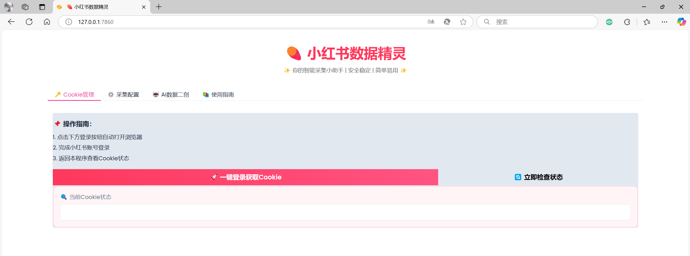
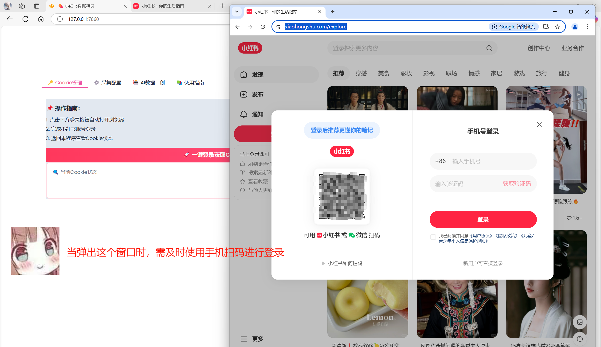
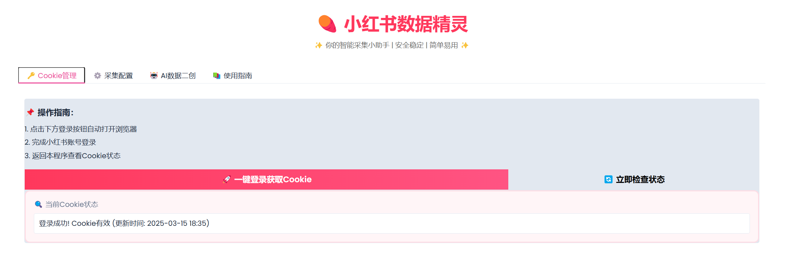
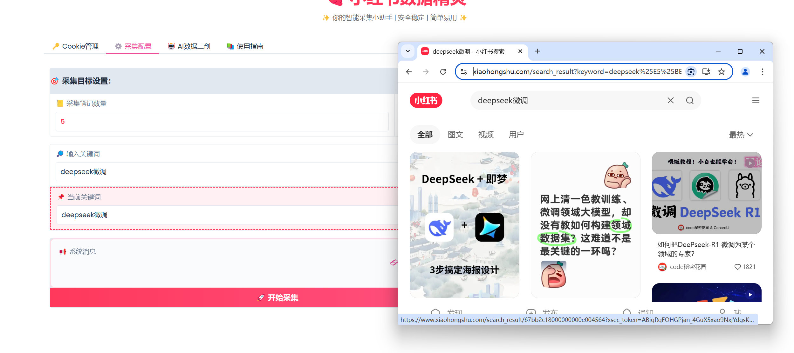
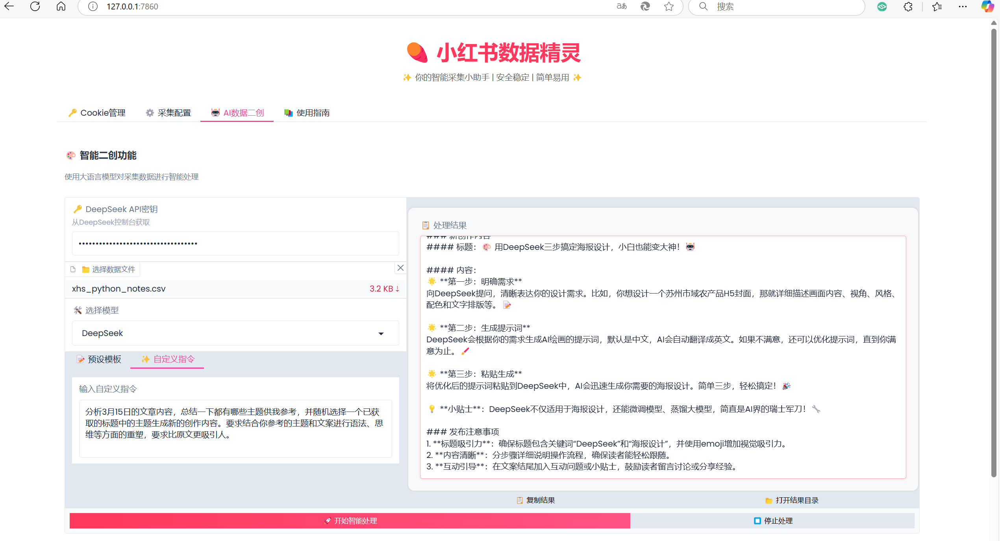

# 🍠 小红书数据精灵 XHS_Crawler_And_Maker


一站式小红书数据采集与智能创作工具，支持自动化采集、AI内容生成和数据分析

[立即体验](#快速开始) | [功能演示](#功能演示) | [开发计划](#待开发功能)

## 🌟 核心功能

### 1. 智能Cookie管理

- 🚀 **一键登录**自动获取浏览器Cookie
- 🔍 实时Cookie状态监测
- ⚡ Edge/Chrome浏览器无缝支持

### 2. 精准数据采集

- 🔑 **关键词驱动**的内容抓取
- 📦 支持采集：
  - 笔记内容（标题/正文/标签）
  - 用户评论（含情感分析）
  - 互动数据（收藏/点赞/分享）
  - 发布时间与链接
- 📤 数据自动导出为CSV

### 3. AI智能二创

- 🤖 **DeepSeek大模型**深度集成
- 🎭 预设创作模板：
  ```markdown
  - 爆款标题生成
  - 种草文案改写
  - 评论情感分析
  - 热点话题提取

- ✨ 支持自定义Prompt工程
- 💾 结果自动保存与历史记录

## 🛠️ 快速开始

地址：https://github.com/GitHub-Ninghai/xhs_crawler_and_maker

可以使用git拉取仓库

```
git clone https://github.com/GitHub-Ninghai/xhs_crawler_and_maker.git
```

默认使用conda环境进行安装，依次执行下述命令行。

```
conda create --name xhs python=3.10.16 -y
conda activate xhs
pip install -r requirements.txt -i https://pypi.mirrors.ustc.edu.cn/simple
python xhs_crawler_and_maker.py
```

运行之后在浏览器输入：http://127.0.0.1:7860/启动项目

## 📸 功能演示











```bash
正在打开小红书登录页面...
正在保存Cookie...
Cookie状态: Cookie有效 (更新时间: 2025-03-15 18:39)
设置采集限制：每个关键词5篇笔记，每篇笔记5条评论
已添加cookies
开始采集关键词: deepseek微调
已点击最热选项
创建数据文件：data/notes/xhs_python_notes.csv
已采集文章：🤭DeekSeek +即梦，三步搞定海报设计！
连续1次未发现新评论元素
已采集第1条评论
已采集第2条评论
........
........
已采集文章：如何把DeePseek-R1 微调为某个领域的专家？
连续1次未发现新评论元素
已采集第1条评论
已采集第2条评论
.......
.....
已采集第5篇笔记及其评论
已达到5篇笔记上限
关键词 deepseek微调 采集完成
```




## 🚧 待开发功能

| 功能模块       | 进度     | 预计上线 |
| :------------- | :------- | :------- |
| 图片批量下载   | 🔄 开发中 | 2025.03  |
| 多模型支持     | ✅ 已完成 | 2025.04  |
| 数据可视化分析 | 🚧 开发中 | 2025.04  |
| 上线网站       | ⏳ 规划中 | 2025     |

